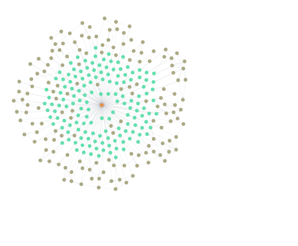

# Лабораториска вежба за граф бази на податоци по предметот Неструктурирани Бази на Податоци

## Вовед и инсталација на neo4j
Neo4j е високо перформансна, оpen-source граф база на податоци наменета за ефикасно складирање, управување и пребарување на поврзани податоци. За разлика од традиционалните релациони бази на податоци кои користат табели и редови, Neo4j користи граф структура составена од јазли, релации и својства. Овој модел природно ги претставува реалните системи и нивните врски, што го прави идеален за апликации како социјални мрежи, препорачувачки системи, откривање измами и knowledge графови.

Во сржта на Neo4j е моделот на „property graph“, каде јазлите претставуваат ентитети (на пример луѓе или производи), релациите претставуваат врски меѓу нив (како „ПРИЈАТЕЛ СО“ или „КУПИЛ“), а и јазлите и релациите можат да имаат својства во форма на key-value парови. Ова овозможува брзо и ефикасно следење на сложени релации со користење на Cypher — декларативен јазик за пребарување специфичен за Neo4j.

Neo4j нуди поддршка за ACID трансакции, добра интеграција со современи програмски технологии, како и локално и cloud хостирање. Идеален е за секоја апликација каде што поврзаноста е подеднакво важна како и самите податоци.

### Инсталација и креирање на инстанца

Наједноставен начин за креирање на инстанца од Neo4j база на податоци е преку docker:

```cmd
docker run --restart always --publish=7474:7474 --publish=7687:7687 neo4j:2025.05.0
```

Доколку сакате податоците да перзистираат потребно е да се креира volume:

```cmd
docker run --restart always --publish=7474:7474 --publish=7687:7687 --env NEO4J_AUTH=neo4j/your_password  --volume=/path/to/your/data:/data neo4j:2025.06.0
```

Со ова се креира контејнер со сликата neo4j и во веб прелистувачот може да се пристапи на линкот http://localhost:7474/browser/

Откако ќе го пристапите Neo4j Browser-от потребно е да се најавите.


Стандардниот password е **neo4j**.

Откако ќе се најавите ќе ви излезе форма за промена на password-от.

Потоа потребно е да се конектирате на некоја инстанца:


Повторно се најавувате и со тоа се комплетира конекцијата.

Откако ќе се конектирате до инстанца: ќе го добиете следниот поглед.


### Вовед во Cypher

**Cypher** е декларативен јазик за прашалници дизајниран специјално за работа со граф бази на податоци како што е **Neo4j**. Наместо табели и редови, Cypher овозможува лесно и читливо изразување на врски меѓу ентитети преку ASCII-стилска синтакса. На пример, јазлите се претставуваат со загради `()`, а релациите со стрелки `-->`.

#### Основни CRUD операции во Cypher

##### Create (Креирање)

```cypher
CREATE (p:Person {name: "Anna", age: 30})
```

Креира јазол со label `Person` и својства `name` и `age`.

```cypher
MATCH (a:Person {name: "Anna"}), (b:Person {name: "Bob"})
CREATE (a)-[:FRIEND_WITH]->(b)
```

Се креира релација `FRIEND_WITH` помеѓу два јазли.

##### Read (Читање / Пребарување)

```cypher
MATCH (p:Person) RETURN p
```

Ги враќа сите јазли со лабела `Person`.

```cypher
MATCH (a:Person)-[:FRIEND_WITH]->(b:Person) RETURN a.name, b.name
```

Ги враќа имињата на сите лица што се пријатели.

##### Update (Ажурирање)

```cypher
MATCH (p:Person {name: "Anna"})
SET p.age = 31
```

Ја ажурира возраста на Ана.

```cypher
MERGE (p:Person {name: "Чедо"})
SET p.age = 25
```

Доколку не постои јазолот се креира нов, или ажурира постоечки.

##### Delete (Бришење)

```cypher
MATCH (p:Person {name: "Чедо"})
DETACH DELETE p
```

Го брише јазолот и сите негови релации.

#### Филтрирање (WHERE услови)

`WHERE` се користи за филтрирање на резултатите според одредени услови:

За да ги добиеме лицата постари од 30 години:
```cypher
MATCH (p:Person)
WHERE p.age > 30
RETURN p.name, p.age
```

За да ги добиеме лицата чие име почнува на "A"
```cypher
MATCH (p:Person)
WHERE p.name STARTS WITH "А"
RETURN p
```

Филтрирање според својства на релација

```cypher
MATCH (a:Person)-[r:FRIEND_WITH]->(b:Person)
WHERE r.since > 2020
RETURN a.name, b.name
```

#### Агрегации (COUNT, AVG, SUM, итн.)**

Cypher поддржува агрегатни функции за групирање и анализа:

За да изброиме колку јазли има со label `Person` во базата:

```cypher
MATCH (p:Person)
RETURN count(p) AS vkupno_lica
```
За да пронајвеме просечна возраст на лицата:
```cypher
MATCH (p:Person)
RETURN avg(p.age) AS prosecna_vozrast
```

За да изброиме колку лица има по град и сортирање според бројот во опаѓачки редослед:
```cypher
MATCH (p:Person)
RETURN p.city, count(*) AS broj_lica
ORDER BY broj_lica DESC
```

### Најкратки патишта (shortestPath) и Dijkstra

Со `shortestPath()` можеш да најдеш најкратка врска помеѓу два јазла:

За да го пронајдеме најкраткиот пат од Anna до Bob

```cypher
MATCH (a:Person {name: "Anna"}), (b:Person {name: "Bob"})
MATCH path = shortestPath((a)-[:FRIEND_WITH*]-(b))
RETURN path
```
Со операторот .. може да се ограничи и бројот на чекори за пребарување:

```cypher
MATCH (a:Person {name: "Anna"}), (b:Person {name: "Bob"})
MATCH path = shortestPath((a)-[:FRIEND_WITH*..4]-(b))
RETURN path
```
На големи графови, `shortestPath()` може да биде бавно. Може да се искористи `LIMIT`, `WHERE` или `*..n` за ограничување на длабочината.

#### Dijkstra

Neo4j работи со in-memory проекции за алгоритми од библиотеката GDS

1. Потребно е да се направи проекција на графот
```cypher
CALL gds.graph.project(
  'cityGraph',                  // име на проектираниот граф
  'City',                       // јазли
  {
    ROAD: {
      type: 'ROAD',
      properties: 'distance'    // тежинско својство
    }
  }
)
```
2. Се повикува функцијата за да се пронајде најкраткиот пат:
```cypher
CALL gds.shortestPath.dijkstra.stream('cityGraph', {
  sourceNode: gds.util.asNodeId($start),  // ID на почетниот јазол
  targetNode: gds.util.asNodeId($end),    // ID на целниот јазол
  relationshipWeightProperty: 'distance'
})
YIELD index, sourceNode, targetNode, totalCost, nodeIds, costs
RETURN
  gds.util.asNode(sourceNode).name AS from,
  gds.util.asNode(targetNode).name AS to,
  totalCost,
  [nodeId IN nodeIds | gds.util.asNode(nodeId).name] AS path
```
3. Потребно е да се избрише проекцијата
```cypher
CALL gds.graph.drop('cityGraph')
```

### Сложени прашалници
#### `OPTIONAL MATCH` – за необврзувачки врски (left outer join)

```cypher
MATCH (p:Person)
OPTIONAL MATCH (p)-[:FRIEND_WITH]->(f:Person)
RETURN p.name, f.name
```

#### `WITH` – за пренесување резултати или агрегации помеѓу чекори

```cypher
MATCH (p:Person)-[:FRIEND_WITH]->(f)
WITH p, count(f) AS friendCount
WHERE friendCount > 5
RETURN p.name, friendCount
```
Се користи и за **филтрирање по агрегати**, **групирање** или **paging** (`SKIP`, `LIMIT`).

#### `UNWIND` – од листа прави редови

```cypher
UNWIND [1, 2, 3] AS x
RETURN x * 2 AS doubled
```

Или за batch внесување:

```cypher
UNWIND [
  {name: "Ана", age: 25},
  {name: "Бојан", age: 30}
] AS row
CREATE (:Person {name: row.name, age: row.age})
```
#### `FOREACH` – за извршување акција врз елементи од листа

```cypher
MATCH (p:Person {name: "Ана"})
SET p.tags = ["dev", "neo4j"]

FOREACH (tag IN p.tags |
  CREATE (p)-[:HAS_TAG]->(:Tag {name: tag})
)
```

#### `MERGE` – „match or create“

```cypher
MERGE (p:Person {name: "Ана"})
ON CREATE SET p.age = 25
ON MATCH SET p.lastSeen = date()
```

### Индекси и ограничувања

Индексите значително го забрзуваат `MATCH` со филтри (`WHERE p.name = "Ана"`).
#### Креирање индекс:

```cypher
CREATE INDEX FOR (p:Person) ON (p.name)
```

#### UNIQUE Constraint:

```cypher
CREATE CONSTRAINT FOR (p:Person) REQUIRE p.email IS UNIQUE
```

### Внесување на податоци

#### LOAD CSV
CSV фајлот треба да има header (прва линија со имиња на колони), на пример:
```
name,age,city
Anna,25,Paris
Bob,30,Beijing
```

``LOAD CSV`` е корисен кога имаме мали до средно големи податочни множества.

```cypher
LOAD CSV WITH HEADERS FROM 'file:///your_file.csv' AS row
CREATE (n:NodeLabel {property1: row.column1, property2: row. column2})
```
-	WITH HEADERS: означува дека првиот ред од CSV-фајлот содржи хедери (имиња на колони), кои понатаму може да се користат како имиња на полињата.
- AS row: На секој ред од CSV-фајлот му доделува променлива со име row, преку која се пристапува до вредностите од тој ред.
- file:///your_file.csv – фајлот мора да биде во import директориумот! (your_file е името на вашиот фајл)
- row.column1, row.column2 се колоните.
- CREATE или MERGE: Се користат за креирање (CREATE) или ажурирање (MERGE) на јазли и релации врз основа на податоците од CSV-фајлот.

Пример:
```csv
from,to,since
Anna,Bob,2015
Bob,Gabriel,2018
```

Креирање на јазли и релација:
```cypher
LOAD CSV WITH HEADERS FROM 'file:///friends.csv' AS row
CREATE (a:Person {name: row.from})
CREATE (b:Person {name: row.to}) 
CREATE (a)-[:FRIEND_WITH ]->(b) 
```

Откако ќе го извршиме CREATE прашалникот, го добиваме следниот граф:


Но доколку веќе постојат јазли со тие имиња, место да ги креираме CREATE може да искористиме MERGE за да избегнеме дупликати. 
MERGE проверува дали таков јазол веќе постои – ако постои, го користи него; ако не, создава нов, а CREATE секогаш креира нов јазол.

```cypher
MERGE (a:Person {name: row.from})
MERGE (b:Person {name: row.to})
CREATE (a)-[:FRIEND_WITH]->(b)
```


#### Користење на neo4j-admin database import команда
- Овој метод е наменет за внесување на многу големи сетови на податоци (над 10 милиони записи) и бара базата да биде офлајн за време на внесот. Подготовка:
- CSV-датотеките треба да бидат специјално структурирани за оваа алатка — одделни датотеки за јазли и релации, и специјални колони како :ID, :START_ID, :END_ID, и :TYPE. 
Извршување:
- Командата се стартува од терминал, при што се специфицираат патеките до CSV-датотеките за јазли и релации.

Пример команда:
```
neo4j-admin database import full --nodes=Person=import/persons.csv --relationships=FRIEND_WITH=import/friends.csv --database=graph.db
```

## Практична работа:

### Податочно множество со книги
Превземете го податочното множество books.csv од import фолдерот и инсертирајте го во база.

```cypher
LOAD CSV WITH HEADERS FROM 'file:///import/books.csv' AS row
MERGE (a:Author {name: row.author})
CREATE (b:Book {title: row.title})
CREATE (a)-[:WROTE {year: toInteger(row.year)}]->(b);
```

#### Задачи
1. Излистај ги сите книги
```cypher
MATCH (b:Book)
RETURN b.title
```
2. Излистај ги сите автори
```cypher
MATCH (a:Author)
RETURN DISTINCT a.name
```
3. Излистај ги сите книги објавени пред 2000
```cypher
MATCH (a:Author)-[r:WROTE]->(b:Book)
WHERE r.year < 2000
RETURN b.title, r.year
```
4. Излистај ги сите книги од “Dan Brown”
```cypher
MATCH (a:Author)-[r:WROTE]->(b:Book)
WHERE a.name = 'Dan Brown'
RETURN b.title
```
5. Број на книги за секој автор подредени во опаѓачки редослед
```cypher
MATCH (a:Author)-[:WROTE]->(b:Book)
RETURN a.name, count(b) AS numberOfBooks
ORDER BY numberOfBooks DESC
```
6. Број на книги за секоја година подредени според годината
```cypher
MATCH (a:Author)-[r:WROTE]->(b:Book)
RETURN r.year, count(b) AS num_books
ORDER BY r.year desc
```
7. Најстарата книга и нејзиниот автор
```cypher
MATCH (a:Author)-[r:WROTE]->(b:Book)
RETURN b.title, a.author, r.year
ORDER BY r.year ASC
LIMIT 1
```
8. Авторот со најмногу книги
```cypher
MATCH (a:Author)-[:WROTE]->(b:Book)
WITH a.name AS name, count(b) AS num_books
ORDER BY num_books DESC
LIMIT 1
RETURN name, num_books
```
9. Годината со најмногу издадени книги
```cypher
MATCH (a:Author)-[r:WROTE]->(b:Book)
RETURN r.year, count(*) AS num_books
ORDER BY num_books DESC
LIMIT 1
```
10. Сите книги чиј автор има издадено повеќе од 2 книги 
```cypher
MATCH (a:Author)-[:WROTE]->(b:Book)
WITH a, count(b) AS num_books
WHERE num_books > 2
MATCH (a)-[:WROTE]->(c:Book)
RETURN c.title AS title
```


### Податочни множества со пријателства
Превземете ги датотеките people.csv, friendships.csv, countries.csv од import фолдерот и инсертирајте ги во базата.

```cypher
LOAD CSV WITH HEADERS FROM 'file:///import/people.csv' AS row
MERGE (a:Person {name: row.name, age: toInteger(row.age)})
MERGE (b:City {name: row.city})
CREATE (a)-[:LIVES_IN]->(b);

LOAD CSV WITH HEADERS FROM 'file:///import/friendships.csv' AS row
MATCH (a:Person {name: row.from})
MATCH (b:Person {name: row.to})
CREATE (a)-[:FRIEND_WITH {since: toInteger(row.since)}]->(b);

LOAD CSV WITH HEADERS FROM 'file:///import/countries.csv' AS row
MATCH (city:City {name: row.name})
SET city.population = toInteger(row.population)
MERGE (country:Country {name: row.country})
CREATE (city)-[:IS_IN]->(country);
```

По вчитување на сите csv фајлови, се добива граф кој треба да изгледа слично на овој:


#### Задачи:
1. Пронајди го најкраткиот пат помеѓу двајца Samantha и Jessica и испиши ги сите имиња на јазлите низ кои минува патот.

```cypher
MATCH (a:Person {name: "Samantha"}), (b:Person {name: "Jessica"})
MATCH path = shortestPath ((a)-[: FRIEND_WITH*] -(b))
RETURN [n IN nodes (path) | n.name] AS path
```

2. За секој човек, колку пријатели има што живеат во различен град од неговиот.
```cypher
MATCH (p:Person)-[:LIVES_IN]->(pc:City)
MATCH (p)-[:FRIEND_WITH]->(f:Person)-[:LIVES_IN]->(fc:City)
WHERE pc.name <> fc.name
RETURN p.name AS person, count(f) AS friends_in_other_cities;
```

3. Пронајди ги сите лица што немаат пријатели:
```cypher
MATCH (p:Person)
WHERE NOT (p)-[:FRIEND_WITH] - (:Person)
RETURN p.name
```

4. Пронајди го лицето кое има најмногу пријатели
```cypher
MATCH (p: Person) - [:FRIEND_WITH] ->(f:Person)
RETURN p.name, count(f) AS num_friends
ORDER BY num_friends DESC
LIMIT 1
```